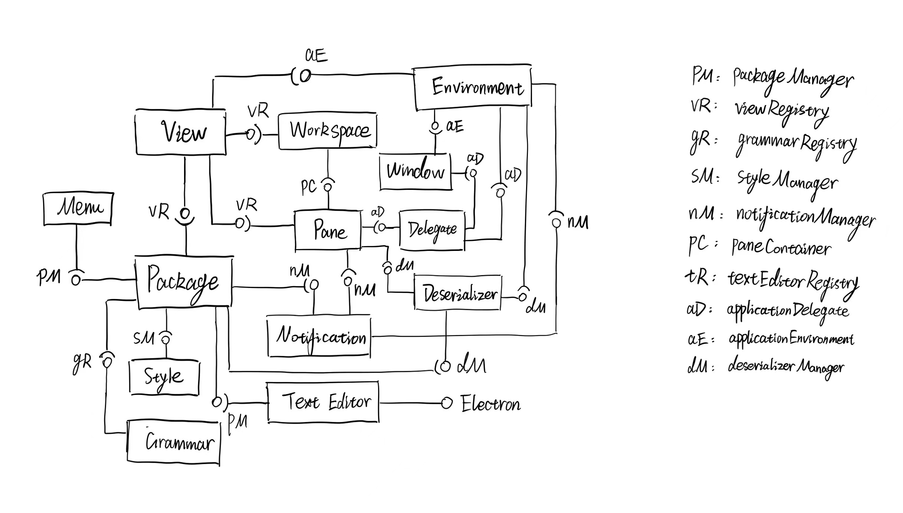

# INFO 443 Project - Atom
_by Yilin Chen, Jossie Choi, Debbie Dai and Stephan Rubalcava_

## Brief Description
Atom is a text editor that is unique in that it supports markdown and javascript plugins. These allow for users to do much more than conventional text editors. It also enables user to work directly with Git and Github.

Mainly Developed by GitHub, Atom is a desktop application built using web technologies. But it is also community-built and maintained. This project is not only maintained by GitHub but also their community, with an upwards of 400+ contributors that are active to this day.

You can find more information about the overall structure of Atom at [Atom and Packages](https://github.com/atom/atom/blob/master/CONTRIBUTING.md) and more details at [Atom Flight Manual](https://flight-manual.atom.io/). And [atom/atom](https://github.com/atom/atom) is the repository we claim to analyze.

## Development View
atom/atom is the core repository that responsible for basic text editing.

<em>Figure 1: UML Component Diagram</em>

&nbsp;

### Dependency Identity
Begin from the left of Figure (Figure 1: UML Diagram),
Menu component, which handles thing in application menu, requires packageManager that is used to coordinate the lifecycle of Atom packages to set up. Package component contains core packages that help to build the system.
It provides packageManager interface to Menu and Text Editor. And it requires grammarRegistry provided by Grammar component, which contains one or more grammars, and styleManager from Style Component, which can query and observe the set of active styles. Notification is a component that hold notices for instructions and it provide notifivationManager, used to create notifications to be shown to the user, to Package、Pane、and Environment component. The main function of Deserializer component is covert data and paralle interface in both way. Here, it gives out deserializerManager to Package、Pane、and Environment component. Providing paneContainer to Workspce only and requiring viewRegistry from View and applicationDelegate from Delegate, Pane is used to help user spliting the pane for better texting. And paneContainer presents content in the center of the workspace. View deal with the data presentation and interaction from user. And View componet, the viewRegistry handles the connection betweem model and view. It provides viewRegistry to Package、Pane and Workspace. In addtion, Workspace shows the status of window of user interface. Back to View, it receive applicationEnvironment of Environment component that indirectly charge main components like Window, Menu and so on. Except components mentioned before, Environment also provide interface to Window. Window itself presents the open page of Atom. It requires applicationEnvironment of Environment and applicationDelegate of Delegate. Finally Delegate implements events and callbacks like event listener. And it provides applicationDelegate to Pane、Window and Environment. Last but not least, is involves Electron, a framework help to build app, from outside package.

### Codeline Model
The names of files and directories are rather descriptive. For example, folder src holds the main source files and spec keeps testing code of basically all components. And file names are easy to understand at a glance since they are named as 'component-status' although files that set up a component cannot be extract and put in a folder seperately. However, it allows programmers to use relative paths since all files that call each other to work are put in the same directory.

Many functionalities of Atom are achieved by packages. And like atom/atom repository, it only contains things to do with core part of basic text editing which means it seperates packages into other repositories and relates them by links. This approach enables a highly flexible developing approach, where changes in single packages will not affect other functionalities. In addition, Atom allows packages to depend on other packages, substituding the redundancy with simple dependency statement.

It has a detailed README.md for for the main repository but lack explaination for other important folders.

### Testing and Configuration
The Atom core is tested by about 80 files containing test code, not including the large amount of fixtures used as test cases. These files with test code are again almost entirely bundled into one folder named `spec`, correspond to each component. Atom is tested using the [Jasmine](https://jasmine.github.io/) testing framework. Jasmine is a open-source test framework that can be run on any JavaScript-enabled platform. It has a clean and simple syntax for writing test in spec file and then you just need to make the source file available to spec file. 

And Atom uses Continuous Integration tools like [GitHub Actions](https://github.com/features/actions), [Travis CI](https://travis-ci.org/) and [Appveyor](https://www.appveyor.com/) to do a test build for each new pull request, including running the entire test suite. Pull requests merged almost all by others than pull request initiator, which gurantees the code be checked before merge. 

## Applied Perspective
In this project, we will be focusing on **Usability Perspective** when analyzing the architecture of Atom. 

The desired quality of Usability Perspective is “the ease with which people who interact with the system can work effectively". (Rozenski)

If you are an UI/UX designer, this may seem crazy to you that software architecture also has to consider Usability, not from a human interaction design perspective that focus on the User Interfaces where people see on the front-end, but mainly focus on the ease of user and developer (including people who maintain the system) to interact with the system architecture effectively that contribute to the usability of the overall system. 

### Concerns
<ul>
<li>The first concern relevant to Atom system architecture is how well the <strong>perceived usability</strong> is. The instances we will be focusing on for this concern is the use of asynchronous operation of the system because for code editor like Atom, we want the use to: 1. receive the transactions returned before it has completed in the database, “providing significant improvements in observed response time”. (Rozenski) 2. operate local systems that continue in offline mode, meaning that users are able to use the editor even if the network is off. </li>
<li>Furthermore, not only for Atom but most software systems need to consider how easy it is for changing the user interfaces because according to Rozenski, “<strong>the difficulty of changing user interfaces</strong> can impact system’s usability”. To make changing the UI easier, we need to consider if the Atom system has a modification friendly architecture so the developers and maintainers could easily make routine modifications based on user feedback, especially Atom is maintained by the Gtihub community, so it is crucial to evaluate how ease for the community to change the UI on Atom system. </li>
<li>The third perspective we will consider in the Atom system is the <strong>simple process flow</strong>. Since Atom involves different types of users, including companies, developers, students, etc. that are doing different tasks, meanwhile each task may involve complex and multiple steps, lile preview, terminal, opening files and folders, coding… Therefore, the “process flow around the system should be simple, understandable, and consistent”. (Rozenski)  By checking the system process flow, we will ensure that Atom is sufficient and straightforward for users to complete the tasks.</li>
</ul>

### Activities To Apply The Perspective
<ol>
<li>Interface evaluation</li>
Identify places where users interact with the system(maybe using our UML diagram) and how users will interact at this point. 
Then focusing on the perceived usability concern, specifically how the system return responses to the user and checking for asynchronous working each point if applicable. 
Understanding the internal system and public interfaces, and how easy it is to modify the user interfaces in the system. 
<li>Particiatory design</li>
Understand different user’s capability of using the system and what their needs are. 
Then based on their needs, find out the simplicity of the process flow for different users.
</ol>

 

## Styles & Patterns
### Styles
1.  Pipe and filter: main > Start  > application > initialize application window > Atom-environment
  a. The startup process utilizes the pipe and filter style where the filters are the different classes in the sequence. The chain of startup starts with src/main-process/main.js which gets the values of the resourcePath(where everything is located), devResourcePath(where the github repo is), and the startTime. These values are all piped into to start.js which normalizes them and adds the path of the file that the user is editing, it then pipes the values to atom-application.js. This gets information about the current instance of the application and pipes the information about the current window into multiple files, the main one being src/initialize-application-window.js which uses the data to display the application to the user and is the end of the pipe.

2. Model view Controller
  a. The main component of the application can be best described as a Model-View-Controller. The model in this instance is the file that is being viewed/edited by the user which is not a part of the core atom system. The view is the process in atom-environent.js, this file is called on by initialize-application-window.js which uses a combination of other files to display all of the components that the user sees when running atom. Finally, the controller is the text editor (text-editor.js) which modifies the text file directly.
  This isn't a pure MVC application because the model is only viewed through the text editor, but atom-environment.js displays the text editor along with other information, so it could be considered the view, but it could go either way.

### Patterns
1. Singleton: Atom-Application 485  
  Context: As a markdown editor, users will likely open multiple different files with Atom, this will mean launching multiple different instances of Atom.

  Problem: Launching multiple separate instances of Atom will be very intensive system resources, especially for what is achievable in a singular instance of Atom.

  Solution: Make the Atom process act as a singleton.
  The function at line 485 creates a local server to listen for other Atom launches on the device, if another instance is launched, they will pass all of their data to the first instance and then close, in effect merging the two. Although not a conventional implementation of the Singleton pattern, which normally uses variables to track if it has already been instantiated. This function in effect makes the Atom instance a singleton by closing all other instances of itself and taking on their data.

2. Atom Environment 1060 factory
  Context: Atom stores information about the version and other factors related to the program after startup, this information is serialized in JSON format.

  Problem: When sending information to/from API endpoints converting regular data into JSON objects can require a lot of extra code. This is especially the case in large programs such as Atom which often interact with large complex objects that are pulled from the users device. These can be hard to read through to decide what information is needed.

  Solution: Using the factory pattern to create a method which creates JSON objects from an inputted value can help provide an easy method for creating an object with only necessary data. Having a standard format for transmitting this data can be very useful as every time the object that is created is called it will have the same data.

3. Text editor 356 decorator
  Context: In Atom the line where the cursor is, is styled differently than the other lines in order to help the user see where they will be typing more easily.

  Problem: Creating an entirely new object for the highlighted cursor line would require a lot of "smelly" code and would likely decrease run time along with inviting a variety of other problems.

  Solution: The function "decorateCursorLine" applies a variety of decorator objects (both literally and in the design pattern sense) on top of the already existing cursor line object. This is a good example of the decorator pattern because it is not applying all of the styling at once, but rather applying 3 different layers of styling on top of the already existing cursor instance.

4. Text-editor 1232 factory
  Context: The ability to copy text is integral for any text editor, it may seem as simple as just duplicating the text but it is more complex in an application like this.

  Problem: In atom text has more properties than just the ascii value of the text being copied, there has a lot more data being transmitted in order for the formatting to be correct.

  Solution: An implementation of the factory pattern in the copy() method. This creates a new TextEditor object and stores the copied data in there including any formatting and background information that is needed for it to be properly pasted within another location in atom. This helps the copying and cutting operations have a more consistent output so that the pasting option can work better.

 

## Architectural Assessment
Next we assessed the architecture of the Atom project, identfiying instances where various design principles were adhered to and not within the code.

 

<h3>Open-Closed Principle</h3>
The <strong>Open-Closed Principle</strong> is the second of the SOLID design principles in object oriented programming and states that classes should be open for extension but closed for modification. By promoting extensibility in this way, we can prevent any errors or bugs from arisiing from adding any new functionality that can come from modifying lower-level components directly.

 

One prevalent instance of this principle being adhered to in the Atom project code is the project's use of classes that extend the node.js [`EventEmitter`](https://nodejs.dev/learn/the-nodejs-event-emitter) class. Some notable examples of this include the `AutoUpdater`, `AutoUpdateManager`, `AtomWindow`, and `AtomApplication` classes. By extending upon the `EventEmitter` class, these new classes inherit critical functionality surrounding events while also building upon it and containing their own nuanced functionality specific to their use cases. No direct modifications are ever done to the `EventEmmiter` class itself within each subclass, only extending functionality. Looking at the `AtomApplication` class's `handleEvents()` method specifically, we can see how the class uses the inherited `EventEmitter` methods `.on()` and `.emit()` to handle and trigger various application events within the class.
<pre><code>/*  src/main-proccess/atom-application.js  */
module.exports = class AtomApplication extends EventEmitter {
  ...
  handleEvents() {
    // lines 568 - 571
    this.on('application:quit', () => app.quit());
    this.on('application:new-window', () =>
      this.openPath(createOpenSettings({})
    );
    // lines 793 - 799
    this.disposable.add(
      ipcHelpers.on(app, 'activate', (event, hasVisibleWindows) => {
        if (hasVisibleWindows) return;
        if (event) event.preventDefault();
        this.emit('application:new-window');
      })
    );
  }
  ...
}
</code></pre>

 

Another instance of adherence to the open-closed principle can be seen with the `Model` class located in `src/model.coffee` and two of it's subclasses `Project` and `Workspace`. Similar to how the `AtomApplication` mentioned above extends the `EventEmitter` class, these three subclasses build upon the functionality of the `Model` class and utilize the functionality provided in the it such as the constructor through the use of the `super()` method which calls the parent class constructor within their own constructor that performs additional work. Rather than modify existing methods, these two subclasses simply add functionality with additional methods.

 

<h3>Liskov Substitution Principle</h3>
The <strong>Liskov Substitution Principle</strong> is the next principle following the Open-Closed Principle in the SOLID acronym. This principle states that any superclasses should be able to be replaced by any of its subclasses without breaking the program. Adhereing to this principle not only improves the maintainability of code by preventing the need to have instance of checks to handle specific subclasses differently, but also increases code reusability by using a more standardized model throughout the super and subclasses.

 

One portion of the code that does not abide by this principle can be found with the `Package` class located in `src/package.js` and the `ThemePackage` class located in `src/theme-package.js`. At first glance, it seems as if these two classes are true to the Liskov Substitution Principle, the `ThemePackage` subclass properly extending the `Package` class and utilizing its superclass's constructor, not placing any stricker validation rules on it's input parameters which would cause failures when substituting. Most of the methods in the `Package` class are also used as is when handling the `ThemePackage` class. Additionally, looking at the `src/package-manager.js` file, we can see that the Atom application seems to use these classes interchangably -
<pre><code>// lines 613-614
pack = metadata.theme ? new ThemePackage(options) : new Package(options);
pack.preload();
</code></pre>
However, taking a closer look at the two classes we can see that some of the methods in the `ThemePackage` class do not adhere to the contract imposed by the superclass methods and their return types. Here are some examples:
<pre><code>/* --- enable --- */
// Package
enable() {
  return this.config.removeAtKeyPath('core.disabledPackages', this.name);
}

// ThemePackage
enable() {
  this.config.unshiftAtKeyPath('core.themes', this.name);
}

/* --- disable --- */
// Package
disable() {
  return this.config.pushAtKeyPath('core.disablePackages, this.name);
}

// ThemePackage
disable() {
  this.config.removeAtKeyPath('core.themes', this.name);
}
</code></pre>
These `unshiftAtKeyPath`, `pushAtKeyPath`, and `removeAtKeyPath` methods (defined in `src/config.js`) all return some value at the end. While the `enable()` and `disable()` functions in the `Package` class return these values, the variants in the `ThemePackage` class do not and are `void` functions. This in turn violates the Liskov Susbtitution Principle.

 

On the other hand, we can refer to the `Model` class in `src/model.coffee` mentioned earlier to see an example of code that adheres to the Liskov Substitution Principle. Looking at this superclass code as well as the code for three of its subclasses—`Cursor`, `Workspace`, and `Project`—we can see that the subclasses generally use the base methods provided by the superclass while adding additional functionality. Unlike the `Workspace` and `Project` classes, the `Cursor` project overrides the `destroy()` method. Although this causes a problem with the `Package` and `ThemePackage` classes due to their specific implementations, the `Cursor` and `Model` classes still abide by the Liskov Substitution Principle. Looking at the implementation of `destroy()` in `src/cursor.js` -
<pre><code>// lines 22-24
destroy() {
  this.marker.destroy();
}
</code></pre>
we can see that the subclass-specific method calls the superclass implementation of the method, simply specifiying which marker to check. Also looking at the `Model` implementation of `destroy()` -
<pre><code>// lines 16-19
destroy: ->
  return unless @isAlive()
  @alive = false
  @destroyed?()
</code></pre>
we see that the method contract is not broken between the superclass and subclass implementations of the method. The [CoffeScript documentation for the ?() operator](https://coffeescript.org/#existential-operator) explains that the `@destroyed?()` line returns the result of calling the `destroyed()` method if the method itself is in scope, otherwise returning undefined. The `destroyed()` method exists in both the `Workspace` and `Project` classes but does not exist in the `Cursor` class. This does not cause the code to violate the Liskov Substitution Principle however, as the `destroyed()` method is not the return value of the method and therefore does not affect the overarching contract of the superclass.

 

<h3>Dependency Inversion Principle</h3>
The <strong>Dependency Inversion Principle</strong> is the last principle from the SOLID list. This principle focuses on reducing coupling between modules and states that both low and high-level components/classes should depend on abstractions rather than each other. The following three rules encompass the heuristics of this principle—Subclasses do not <strong>hold a reference to a concrete class</strong>, <strong>derive from a conrete class</strong>, or <strong>override implemented methods</strong>.

 

Revisiting the `Package` and `ThemePackage` classes from earlier we can say that based on the three heuristics of the Dependency Inversion Principle, these two classes do not adhere to it. Looking at `src/theme-package.js` and `src/package.js`, we can see that the `ThemePackage` subclass overrides a handful of the methods implemented in the superclass. These overridden methods include `getType()`, `getStyleSheetPriority()`, `enable()`, `disable()`, `preload()`, `finishLoading()`, `load()`, and `activate()`. In addition to overriding implemented methods, the `ThemePackage` class also derives (extends) from `Package` which is a concrete class and not an abstraction. This results in tight coupling between the two classes.

 

Similarly, we can see that the `Model` class and its subclasses also suffer from the same shortcomings. As mentioned earlier, the `Cursor` class overrides the `Model`'s `destroy()` method which violates one of the principle's heuristics. Additionally, the `Model` is not an abstract class which means that its subclasses `Cursor`, `Workspace`, and `Project` all do not abide by this principle.

 

## References
Rozenski, Nick. "Software Systems Architecture: Working with Stakeholders Using Viewpoints and Perspectives." Second Edition, Chapter 29, Addison-Wesly Professional, 2012, https://learning.oreilly.com/library/view/software-systems-architecture/9780132906135/ch29.html

