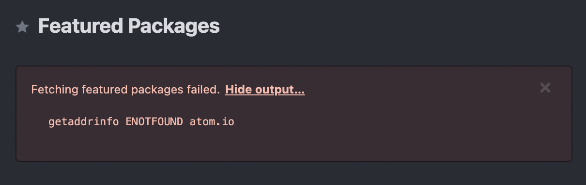
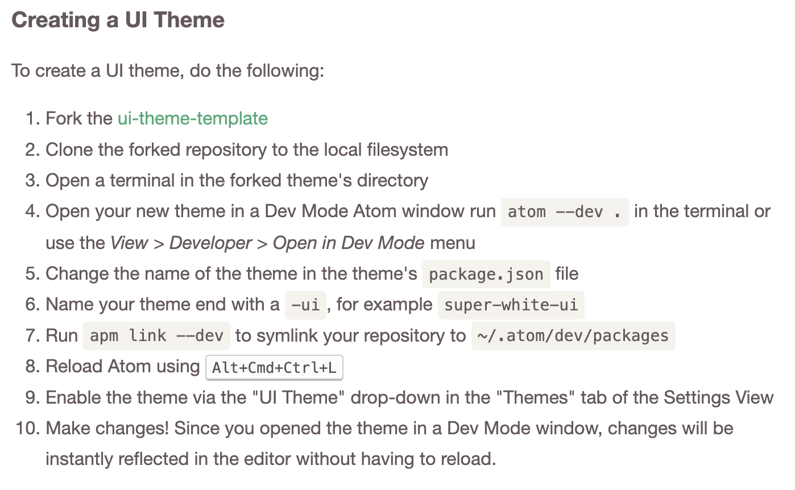
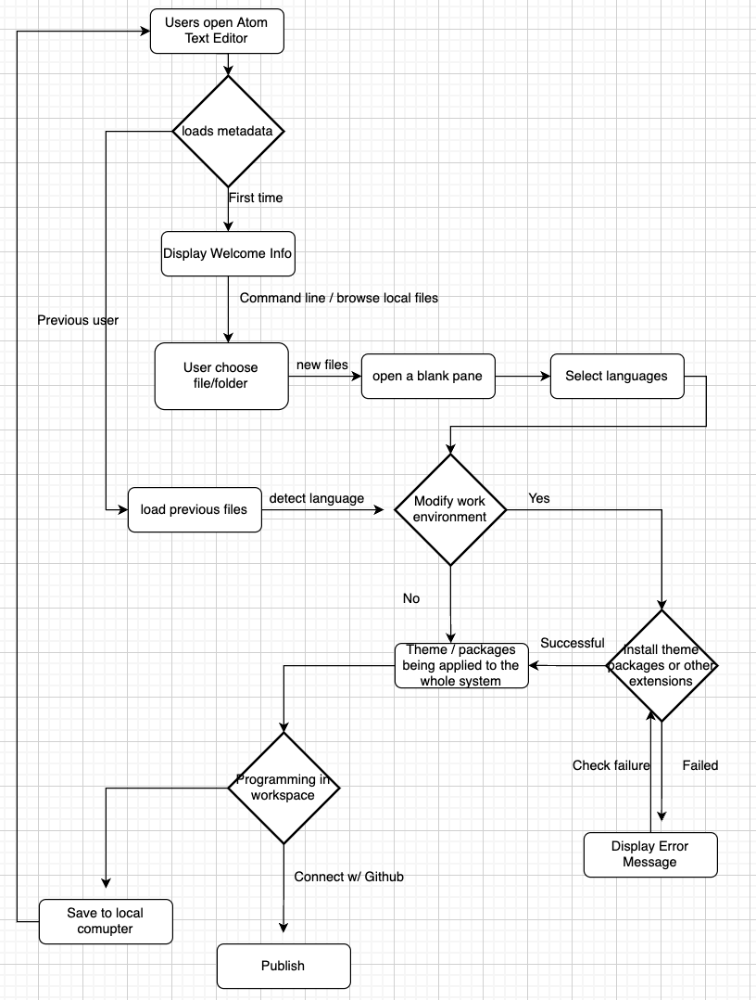

# INFO 443 Project - Atom
_by Yilin Chen, Jossie Choi, Debbie Dai and Stephan Rubalcava_

## Brief Description
Atom is a text editor that is unique in that it supports markdown and javascript plugins. These allow for users to do much more than conventional text editors. It also enables user to work directly with Git and Github.

Mainly Developed by GitHub, Atom is a desktop application built using web technologies. But it is also community-built and maintained. This project is not only maintained by GitHub but also their community, with an upwards of 400+ contributors that are active to this day.

You can find more information about the overall structure of Atom at [Atom and Packages](https://github.com/atom/atom/blob/master/CONTRIBUTING.md) and more details at [Atom Flight Manual](https://flight-manual.atom.io/). And [atom/atom](https://github.com/atom/atom) is the repository we claim to analyze.

## Development View
atom/atom is the core repository that responsible for basic text editing.

<em>Figure 1: UML Component Diagram</em>

&nbsp;

### Dependency Identity
Begin from the left of Figure (Figure 1: UML Diagram),
Menu component, which handles thing in application menu, requires packageManager that is used to coordinate the lifecycle of Atom packages to set up. Package component contains core packages that help to build the system.
It provides packageManager interface to Menu and Text Editor. And it requires grammarRegistry provided by Grammar component, which contains one or more grammars, and styleManager from Style Component, which can query and observe the set of active styles. Notification is a component that holds notices for instructions and it provides notifivationManager, which used to create notifications to be shown to users, to Package、Pane、and Environment component. The main function of Deserializer component is to covert data and paralle interface in both way. Here, it gives out deserializerManager to Package、Pane、and Environment component. Providing paneContainer to Workspace and requiring viewRegistry from View and applicationDelegate from Delegate, Pane is used to help user spliting the pane for better texting. And paneContainer presents content in the center of the workspace. View deal with the data presentation and interaction from user. And for View component, the viewRegistry handles the connection between model and view. It provides viewRegistry to Package、Pane and Workspace. In addtion, Workspace shows the status of window of user interface. Back to View, it receives applicationEnvironment of Environment component that indirectly charges main components like Window, Menu and so on. Except components mentioned before, Environment also provide interface to Window. Window itself presents the open page of Atom. It requires applicationEnvironment of Environment and applicationDelegate of Delegate. Finally Delegate implements events and callbacks like event listener. And it provides applicationDelegate to Pane、Window and Environment. Last but not least, it involves Electron, a framework help to build app, from outside package.

### Codeline Model
The names of files and directories are rather descriptive. For example, folder `src` holds the main source files and `spec` keeps testing code of basically all corresponding components. And file names are easy to understand at a glance since they are named as 'component-status' although files that set up a component cannot be extract and put in a folder seperately. However, it allows programmers to use relative paths because all files that call each other to work are put in the same directory.

Many functionalities of Atom are achieved by packages. And like atom/atom repository, it only contains things to do with core part of basic text editing which means it seperates packages into other repositories and relates them by links. It enables a highly flexible developing approach, where changes in single packages will not affect other functionalities. In addition, Atom allows packages to depend on other packages, substituding the redundant work with simple dependency statement.

It has a quite detailed README.md for for the main repository but lack explainations for other important folders.

### Testing and Configuration
The core of Atom is tested by about 80 files that contains test code, not including the large amount of fixtures used as test cases. These files with test code are almost placed into a folder named `spec`, corresponding to each files in `src`. Atom is tested using the [Jasmine](https://jasmine.github.io/) testing framework. Jasmine is a open-source test framework that can be run on any JavaScript-enabled platform. It has a clean and simple syntax for writing test and then you just need to make the source file available to spec file. Atom use Jasmine 1.3 to run the test by default, but it also allows you to run custom test runner by `atomTestRunner` in `package.json`.

Tests in `spec` will normally all be run to make sure each unit work correctly and independently and all units play their parts as expectation when intergrated. We run tests to verify whether the componets give out the desired result and whether they invoke certain function.

And Atom uses Continuous Integration tools like [GitHub Actions](https://github.com/features/actions), [Travis CI](https://travis-ci.org/) and [Appveyor](https://www.appveyor.com/). They will help to atomatically build and run tests for each new push request and report error immediately. Every commited revision triggers CI tools to work. Then, Pull requests merged almost all by others than pull request initiator, which gurantees the code be checked before merge. 

## Applied Perspective
In this project, we will be focusing on **Usability Perspective** when analyzing the architecture of Atom.

The desired quality of Usability Perspective is “the ease with which people who interact with the system can work effectively". (Rozenski)

If you are an UI/UX designer, this may seem crazy to you that software architecture also has to consider Usability, not from a human interaction design perspective that focus on the User Interfaces where people see on the front-end, but mainly focus on the ease of user and developer (including people who maintain the system) to interact with the system architecture effectively that contribute to the usability of the overall system.

### Concerns
<ul>
<li>The first concern relevant to Atom system architecture is how well the <strong>perceived usability</strong> is. The instances we will be focusing on for this concern is the use of asynchronous operation of the system because for code editors like Atom, we want the use to: 1. receive the transactions returned before it has completed in the database, “providing significant improvements in observed response time”. (Rozenski) 2. operate local systems that continue in offline mode, meaning that users are able to use the editor even if the network is off. </li>
<li>Furthermore, not only for Atom but most software systems need to consider how easy it is for changing the user interfaces because according to Rozenski, “<strong>the difficulty of changing user interfaces</strong> can impact system’s usability”. To make changing the UI easier, we need to consider if the Atom system has a modification friendly architecture so the developers and maintainers could easily make routine modifications based on user feedback, especially Atom is maintained by the Github community, so it is crucial to evaluate how ease for the community to change the UI on Atom system. </li>
<li>The third perspective we will consider in the Atom system is the <strong>simple process flow</strong>. Since Atom involves different types of users, including developers, students that are doing different tasks, meanwhile each task may involve complex and multiple steps, like preview, terminal, opening files and folders, coding… Therefore, the “process flow around the system should be simple, understandable, and consistent”. (Rozenski)  By checking the system process flow, we will ensure that Atom is sufficient and straightforward for users to complete the tasks.</li>
</ul>

### Activities To Apply The Perspective
<ol>
<li>Interface evaluation</li>

For the first activitivity, we identified places where users interact with the system and how users will interact at this point. 
- From the Component Diagram(Figure 1), View Registry is where the users interact and control the system from the Interface, acting as a bridge between frontend and backend. With that being said, users are mainly interacting with Workspace, Pane, and Package. In addition to that, the application environment also is an Atom global that deals with packages, themes, menus, and the window.
  - Pane - A container in the center workspace, and it also includes displaying the file tabs. 
  - Package - Both the system loads the packages, and the user active packages that builds up the whole program, including, stylesheet, keymaps, grammar, editor properties, and menus.
  - Workspace / Environment - The user interface of the entire window, where users interact with the whole Atom environment, that is anything besides editing the pane, like menu, theme, file, window, clipboard, notification, toolbar, etc.

Next, we focused on the perceived usability concern, specifically how the system return responses to the user for asynchronous opepration at each point if applicable.

Most text editors like Atom do not require access to networks, so there is no feedback to users in the Workspace, Pane, and Environment in either online or offline mode because it works fine in both modes. However, when it comes to download packages, there is feedback for being unable to download packages without networks. 

<em>Figure 2: Message for unable to install packages</em>

<em>Figure 3: Output for the error message</em>

To expand on package feedback, we could look at package.js in atom/src. This class is responsible for installing packages and resources like keymaps, stylesheet, gramma, etc., meanwhile it handles the error cases where packages cannot load as expected. For example, this portion of the code in package.js checks for if the package can be loaded from the metadata, and throws errors if it fails to load due to many factors like connectivity. 

<pre><code>load() {
  this.measure('loadTime', () => {
    try {
      ModuleCache.add(this.path, this.metadata);

      this.loadKeymaps();
      this.loadMenus();
      this.loadStylesheets();
      this.registerDeserializerMethods();
      this.activateCoreStartupServices();
      this.registerURIHandler();
      this.registerTranspilerConfig();
      this.configSchemaRegisteredOnLoad = this.registerConfigSchemaFromMetadata();
      this.settingsPromise = this.loadSettings();
      if (this.shouldRequireMainModuleOnLoad() && this.mainModule == null) {
        this.requireMainModule();
      }
    } catch (error) {
      this.handleError(`Failed to load the ${this.name} package`, error);
    }
  });
  return this;
}</code></pre>

 

We also perform the second activity to understand the internal system and public interfaces, and how easy it is to modify the user interfaces in the system.

In Atom's Github, there is a `static` folder. After looking at the `ui` folders, we believe that Atom uses **HTML** and **LESS** framework to generate its interfaces. LESS, is a superset of CSS, that is widely used in Atom systems, especially for how it allows the user to change themes in their interface through different packages. It is highly reusable and requires less effort to make changes to the stylesheets. Inside of the static file, there are many LESS files that serve as stylesheets to the UI components on the Atom interfaces. Meanwhile in the packages file, there are many preloaded themes, such as dark and light themes. Inside of those files, the LESS is overwritten the default stylesheet, so that the user would be able to modify the theme by loading packages. With that also being said, the user could make their own theme!  Based on the below instruction, the user would be able to use LESS framework template, added to the repo and modify the stylesheet. However, it requires some background of CSS and LESS framework in order to implement custom theme. 

<em>Figure 4: Precedure to custmize theme</em>

In `package/dev-live-reload`, this module watches any change in the LESS files and applies them to all the files synchronously. 

Besides making changes to the color theme, users are not capable of modifying the html elements and components on their own because there is no open source for HTML elements. That is on the internal system where only the developers of Atom could see and modify.

<li>Particiatory design</li>
For the third activity, we identified different user’s capability of using the system and what their needs are. In this case, we considered mainly developers, who are very experienced in using text editor and do not need any traning. We also considered students who have various skill level and coding background, from newbie to advanced. 

- Developers
  - Developers should be very familiar with using text editors like Atom. They are able to use command lines to manipulate different files, moving around interfaces and abundant files, installing packages and extensions, and finally publishing the program/system. 
  - Atom should accommodate users to move through many large files and folders. 
- Students
  - Students' capabilities are from different levels, from newbies to masters. They are using Atom for school works and projects, and need to publish the work to submit assignments. 
  - Atom should provide basic tutorials for students to get started on using a text editor. There should be explanations on packages, syntax, and provide suggestions on coding input, local path, debugging, etc.

 

Then, based on most user’s needs for using Atom, we sketch out a process flow for basic coding users. See Figure 5. This diagram has multiple points where fulfill different needs like if the users are newbie or previous users, if the users want to modify the work environment including themes, packages, etc., what if the installation of packages fails, and if they want to publish or save to local. We believe that for newbie coders, the process flow is very simple and does not involve too much package manipulation, that is mainly work in offline mode most of the time. The more package installation involves, the more needs for connection with back end metadata so it complex the workflow process. 

<em>Figure 5: Process flow diagram</em>

</ol>

 

## Styles & Patterns
### Styles
1.  Pipe and filter: main > Start  > application > initialize application window > Atom-environment
  a. The startup process utilizes the pipe and filter style where the filters are the different classes in the sequence. The chain of startup starts with src/main-process/main.js which gets the values of the resourcePath(where everything is located), devResourcePath(where the github repo is), and the startTime. These values are all piped into to start.js which normalizes them and adds the path of the file that the user is editing, it then pipes the values to atom-application.js. This gets information about the current instance of the application and pipes the information about the current window into multiple files, the main one being src/initialize-application-window.js which uses the data to display the application to the user and is the end of the pipe.

2. Model view Controller
  a. The main component of the application can be best described as a Model-View-Controller. The model in this instance is the file that is being viewed/edited by the user which is not a part of the core atom system. The view is the process in pane.js, this file is called on by atom-environment.js which allows the user to see the text that they are editing. Finally, the controller is the text editor (text-editor.js) which modifies the text file directly.
  These files don't perfectly encapsulate the view or the controller as atom has a variety of other files that modify the processes in pane.js and text-editor.js, but those are the main processes used for these files.

### Patterns
1. Singleton: Atom-Application 485  
  Context: As a markdown editor, users will likely open multiple different files with Atom, this will mean launching multiple different instances of Atom.

  Problem: Launching multiple separate instances of Atom will be very intensive system resources, especially for what is achievable in a singular instance of Atom. Additionally in Atom-Application different system metrics are sent for analysis, so running this process multiple times could result in duplicate entries.

  Solution: Make the Atom process act as a singleton.
  The function at line 485 creates a local server to listen for other Atom launches on the device, if another instance is launched, they will pass all of their data to the first instance and then close, in effect merging the two. Although not a conventional implementation of the Singleton pattern, which normally uses variables to track if it has already been instantiated. This function in effect makes the Atom instance a singleton by closing all other instances of itself and taking on their data.
  <pre><code>
  //Enforces that the class AtomApplication is a singleton
  async listenForArgumentsFromNewProcess() {
  this.socketSecretPromise = createSocketSecret(this.version);
  this.socketSecret = await this.socketSecretPromise;
  this.socketPath = getSocketPath(this.socketSecret);

  await this.deleteSocketFile();

  const server = net.createServer(connection => {
    let data = '';
    connection.on('data', chunk => {
      data += chunk;
    });
    connection.on('end', () => {
      try {
        const options = decryptOptions(data, this.socketSecret);
        this.openWithOptions(options);
      } catch (e) {
        // Error while parsing/decrypting the options passed by the client.
        // We cannot trust the client, aborting.
      }
    });
  });
  </code></pre>

2. Atom Environment 1060 factory
  Context: Atom stores information about the version and other factors related to the program after startup, this information is serialized in JSON format.

  Problem: When sending information to/from API endpoints converting regular data into JSON objects can require a lot of extra code. This is especially the case in large programs such as Atom which often interact with large complex objects that are pulled from the users device. These can be hard to read through to decide what information is needed.

  Solution: Using the factory pattern to create a method which creates JSON objects from an inputted value can help provide an easy method for creating an object with only necessary data. Having a standard format for transmitting this data can be very useful as every time the object that is created is called it will have the same data.
  <pre><code>
  serialize(options) {
    return {
      version: this.constructor.version,
      project: this.project.serialize(options),
      workspace: this.workspace.serialize(),
      packageStates: this.packages.serialize(),
      grammars: this.grammars.serialize(),
      fullScreen: this.isFullScreen(),
      windowDimensions: this.windowDimensions
    };
  }
  </code></pre>

3. Text editor 356 decorator
  Context: In Atom the line where the cursor is, is styled differently than the other lines in order to help the user see where they will be typing more easily.

  Problem: Creating an entirely new object for the highlighted cursor line would require a lot of "smelly" code and would likely decrease run time along with inviting a variety of other problems.

  Solution: The function "decorateCursorLine" applies a variety of decorator objects (both literally and in the design pattern sense) on top of the already existing cursor line object. This is a good example of the decorator pattern because it is not applying all of the styling at once, but rather applying 3 different layers of styling on top of the already existing cursor instance.
  <pre><code>
    decorateCursorLine() {
      this.cursorLineDecorations = [
        this.decorateMarkerLayer(this.selectionsMarkerLayer, { //Deocrator 1
          type: 'line',
          class: 'cursor-line',
          onlyEmpty: true
        }),
        this.decorateMarkerLayer(this.selectionsMarkerLayer, { //Decorator 2
          type: 'line-number',
          class: 'cursor-line'
        }),
        this.decorateMarkerLayer(this.selectionsMarkerLayer, { //Decorator 3
          type: 'line-number',
          class: 'cursor-line-no-selection',
          onlyHead: true,
          onlyEmpty: true
        })
      ];
    }
  </code></pre>

4. Text-editor 1232 factory
  Context: The ability to copy text is integral for any text editor, it may seem as simple as just duplicating the text but it is more complex in an application like this.

  Problem: In atom text has more properties than just the ascii value of the text being copied, there has a lot more data being transmitted in order for the formatting to be correct.

  Solution: An implementation of the factory pattern in the copy() method. This creates a new TextEditor object and stores the copied data in there including any formatting and background information that is needed for it to be properly pasted within another location in atom. This helps the copying and cutting operations have a more consistent output so that the pasting option can work better.
  <pre><code>
    copy() {
      const displayLayer = this.displayLayer.copy();
      const selectionsMarkerLayer = displayLayer.getMarkerLayer(
        this.buffer.getMarkerLayer(this.selectionsMarkerLayer.id).copy().id
      );
      const softTabs = this.getSoftTabs();
      return new TextEditor({
        buffer: this.buffer,
        selectionsMarkerLayer,
        softTabs,
        suppressCursorCreation: true,
        tabLength: this.getTabLength(),
        initialScrollTopRow: this.getScrollTopRow(),
        initialScrollLeftColumn: this.getScrollLeftColumn(),
        assert: this.assert,
        displayLayer,
        grammar: this.getGrammar(),
        autoWidth: this.autoWidth,
        autoHeight: this.autoHeight,
        showCursorOnSelection: this.showCursorOnSelection
      });
    }
  </code></pre>
 

## Architectural Assessment
Next we assessed the architecture of the Atom project, identfiying instances where various design principles were adhered to and not within the code.

 

### Model In Code Principle
The <strong>Model In Code Principle</strong> is exactly what its name suggests. This principle states that the code itself should express the model and reveal the design intent of the component or architecture. One of the ways code may be written to adhere to this principle is with the way that parts of the code is named. Some general guidelines include the following—<strong>classes</strong> should be named with <i>nouns</i>, <strong>attributes</strong> with <i>nouns</i> that <i>describe adjectives</i>, and <strong>methods</strong> with <i>verbs</i> that connect classes.

 

Taking a look at the `Package` class mentioned above we can see good examples of the code adhering to this principle. Specifically looking at the way that methods/functions are named, we can see various examples of verbs being utilized in the function names to describe exactly what that particular function does. Common patterns in this particular file include methods named starting with `get` for functions that retrieve some aspect of the application code;
<pre><code>// lines 527-547
getKeymapPaths() {
  const keymapsDirPath = path.join(this.path, 'keymaps');
  if (this.metadata.keymaps) {
    return this.metadata.keymaps.map(name =>
      fs.resolve(keymapsDirPath, name, ['json', 'cson', ''])
    );
  } else {
    return fs.listSync(keymapsDirPath, ['cson', 'json']);
  }
}

getMenuPaths() {
  const menusDirPath = path.join(this.path, 'menus');
  if (this.metadata.menus) {
    return this.metadata.menus.map(name =>
      fs.resolve(menusDirPath, name, ['json', 'cson', ''])
    );
  } else {
    return fs.listSync(menusDirPath, ['cson', 'json']);
  }
}
</code></pre>
as well as functions starting with `has` for those returning a boolean value indicating whether something is present or not
<pre><code>// lines 966-983
hasActivationHooks() {
  const hooks = this.getActivationHooks();
  return hooks && hooks.length > 0;
}

hasWorkspaceOpeners() {
  const openers = this.getWorkspaceOpeners();
  return openers && openers.length > 0;
}

hasActivationCommands() {
  const object = this.getActivationCommands();
  for (let selector in object) {
    const commands = object[selector];
    if (commands.length > 0) return true;
  }
  return false;
}
</code></pre>
These function names describe exactly what they are doing and therefore does not require any other reader to look too deep into the code in order to understand it. This increases the overall ease of use when it comes to maintaining and modifying the existing code. One example of a function whose code does not express the model is the `measure()` function -
<pre><code> // lines 80-85
measure(key, fn) {
  const startTime = window.performance.now();
  const value = fn();
  this[key] = Math.round(window.performance.now() - startTime);
  return value;
}
</code></pre>
While the function name does express that it is measuring something, it does not specify what exactly it is measuring which leads to ambiguity about it's functionality. Looking at the code that utilizes this function, we can see that it is generally used to measure the amount of time a given action takes to be completed/load. This is something that could not be inferred from the function's name itself even looking at the class name.

 

Another portion of the code that adheres to this principle includes the `NotificationManager` class found in `src/notification-manager.js`. Similar to the examples shown with the `Package` class, this class has various methods with names that are very self explanatory and provide insight as to their specific responsibilities. The two most prevalent examples in this class are function names starting with `on` to describe functions that handle callbacks
<pre><code>// lines 25-27
onDidAddNotification(callback) {
  return this.emitter.on('did-add-notification', callback);
}

// lines 34-36
onDidClearNotifications(callback) {
  return this.emitter.on('did-clear-notifications', callback);
}
</code></pre>
and functions with names starting with `add` to describe functions that add notifications to the array
<pre><code>// lines 94-96
addInfo(message, options) {
  return this.addNotification(new Notification('info', message, options));
}

// lines 122-124
addWarning(message, options) {
  return this.addNotification(new Notification('warning', message, options));
}

// lines 192-196
addNotification(notification) {
  this.notifications.push(notification);
  this.emitter.emit('did-add-notification', notification);
  return notification;
}
</code></pre>
Zooming out, we can also see how the classes interact with eachother from just their names alone. For example, we can correctly infer that the `NotificationManager` class manages the `Notification` class by collecting the various instances of `Notification` and displaying them and their statuses.

 

### Principle of Separation of Concerns
The <strong>Principle of Separation of Concerns</strong> states that software should be organized in a way that decreases cohesion and coupling meaning that the elements should be as independent as possible. This principle helps to reduce various anti-patterns from arising in the code.

 

Going back to the `NotificationManager` and `Notification` classes, we can say that this small section of the code does adhere to this principle. The separations between these two classes are intentional and work together without the need for inheritance which results in decreased coupling and cohesion. There are no `super()` calls that would result in strong coupling between the two and both classes strictly share the overarching responsbility of handling notifications. Separating the specific concerns related to notification prevents the possibility of any God class/objects in the code. This code smell consists of a class that does or knows too much and is very large with lots of functionality which results in tight coupling and increased cohesion. Although having a manager that instantiates notifications introduces some coupling between the two, the overall structure of these two classes work to decrease any more than is needed.

 

We can also see a decent application of separation of concerns with the elements related to the application window panes. Looking at the code in `src`, we can see that the pane functionality is divided over 7 files that define their own classes including `Pane`, `PaneResizeHandleElement`, `PaneElement`, `PaneContainer`, `PaneContainerElement`, `PaneAxis`, and `PaneAxisElement`. Looking at the code for these classes, we can see that the functionality related to window panes of the application have been spread out over a handful of classes leading to smaller, more manageable and somewhat independent classes. Similar to the earlier example, although there is some coupling with some of these smaller modules being used by another, the overall structure results in a separate element/portion which handles all pane-related functionality and separates these concerns from the other code related to different Atom processes and functionality.

 

### Open-Closed Principle
The <strong>Open-Closed Principle</strong> is the second of the SOLID design principles in object oriented programming and states that classes should be open for extension but closed for modification. By promoting extensibility in this way, we can prevent any errors or bugs from arisiing from adding any new functionality that can come from modifying lower-level components directly.

 

Taking a look at the `AtomApplication` class found in `src/main-process/atom-application.js`, we can see one instance of the code not adhereing to this principle. Taking a look at the class declaration, we can see that the code utilizes inheritance for the `AtomApplication` and extends the node.js [`EventEmitter`](https://nodejs.dev/learn/the-nodejs-event-emitter) class. According to the open-closed principle, classes should be open for extension but closed for modification. Although the class is being extended as intended, we can see in the `AtomApplication`'s constructor that this subclass makes internal modifications to how the class is structured.
<pre><code>// lines 194-212
constructor (options) {
  StartupTime.addMarker('main-process:atom-application:constructor:start');

  super();
  this.quitting = false;
  this.quittingForUpdate = false;
  this.getAllWindows = this.getAllWindows.bind(this);
  this.getLastFocusedWindow = this.getLastFocusedWindow.bind(this);
  this.resourcePath = options.resourcePath;
  this.devResourcePath = options.devResourcePath;
  this.version = options.version;
  this.devMode = options.devMode;
  this.safeMode = options.safeMode;
  this.logFile = options.logFile;
  this.userDataDir = options.userDataDir;
  this._killProcess = options.killProcess || process.kill.bind(process);
  this.waitSessionsByWindow = new Map();
  this.windowStack = new WindowStack();
  ...
}
</code></pre>
In addition to inheriting the parent class' constructor with a call to `super()`, the `AtomApplication` class initializes and assigns more fields. This inheritance of the parent's constructor as well as the internal modification introduces inevitable complications if the `EventEmitter`'s constructor were to ever be modified. The `super()` call in the subclass will automatically inherit those changes and therefore require someone to go into every subclass of the parent and apply changes to their constructors as well. This is especially prevalent with the `EventEmitter` class as it is extended upon and it's constructor called upon with `super()` within various other important classes such as the `AutoUpdater`, `AutoUpdateManager`, and `AtomWindow` classes.

 

Similarly, we can see the same problem with the `Model` class located in `src/model.coffee` and two of its subclasses `Project` in `src/project.js` and `Workspace` in `src/workspace.js`. Looking at the constructors for bothe of these subclasses we can see the same calls to `super()` as well as additional fields being declared/added.
<pre><code>/* project.js => lines 21-31 */
constructor ({
  notificationManager,
  packageManager,
  config,
  applicationDelegate,
  grammarRegistry
}) {
  super();
  this.notificationManager = notificationManager;
  this.applicationDelegate = applicationDelegate;
  this.grammarRegistry = grammarRegistry;
  ...
}
</code></pre>
<pre><code>/* workspace.js => lines 177-185 */
constructor(params) {
  super(...arguments);

  this.updateWindowTitle = this.updateWindowTitle.bind(this);
  this.updateDocumentEdited = this.updateDocumentEdited.bind(this);
  this.didDestroyPaneItem = this.didDestroyPaneItem.bind(this);
  this.didChangeActivePaneOnPaneContainer = this.didChangeActivePaneOnPaneContainer.bind(
    this
  );
  ...
}
</code></pre>

Extending the `Model` class, both subclasses take advantage of the fact that the parent class is open for extension but falters when it comes to respecting that the class is closed for modification by adding new fields within their constructors and changing the structure of the classes. Calling `super()`, these subclasses make themselves vulnerable to potential changes in the `Model` class and it's structure which would require going into these subclasses and modifying them to fit with the parent class' new structure.

 

### Liskov Substitution Principle
The <strong>Liskov Substitution Principle</strong> is the next principle following the Open-Closed Principle in the SOLID acronym. This principle states that any superclasses should be able to be replaced by any of its subclasses without breaking the program. Adhereing to this principle not only improves the maintainability of code by preventing the need to have instance of checks to handle specific subclasses differently, but also increases code reusability by using a more standardized model throughout the super and subclasses.

 

One portion of the code that does not abide by this principle can be found with the `Package` class located in `src/package.js` and the `ThemePackage` class located in `src/theme-package.js`. At first glance, it seems as if these two classes are true to the Liskov Substitution Principle, the `ThemePackage` subclass properly extending the `Package` class and utilizing its superclass's constructor, not placing any stricker validation rules on it's input parameters which would cause failures when substituting. Most of the methods in the `Package` class are also used as is when handling the `ThemePackage` class. Additionally, looking at the `src/package-manager.js` file, we can see that the Atom application seems to use these classes interchangably -
<pre><code>// lines 613-614
pack = metadata.theme ? new ThemePackage(options) : new Package(options);
pack.preload();
</code></pre>
However, taking a closer look at the two classes we can see that some of the methods in the `ThemePackage` class do not adhere to the contract imposed by the superclass methods and their return types. Here are some examples:
<pre><code>/* --- enable --- */
// Package
enable() {
  return this.config.removeAtKeyPath('core.disabledPackages', this.name);
}

// ThemePackage
enable() {
  this.config.unshiftAtKeyPath('core.themes', this.name);
}

/* --- disable --- */
// Package
disable() {
  return this.config.pushAtKeyPath('core.disablePackages, this.name);
}

// ThemePackage
disable() {
  this.config.removeAtKeyPath('core.themes', this.name);
}
</code></pre>
These `unshiftAtKeyPath`, `pushAtKeyPath`, and `removeAtKeyPath` methods (defined in `src/config.js`) all return some value at the end. While the `enable()` and `disable()` functions in the `Package` class return these values, the variants in the `ThemePackage` class do not and are `void` functions. This in turn violates the Liskov Substitution Principle.

 

On the other hand, we can refer to the `Model` class in `src/model.coffee` mentioned earlier to see an example of code that adheres to the Liskov Substitution Principle. Looking at this superclass code as well as the code for three of its subclasses—`Cursor`, `Workspace`, and `Project`—we can see that the subclasses generally use the base methods provided by the superclass while adding additional functionality. Unlike the `Workspace` and `Project` classes, the `Cursor` project overrides the `destroy()` method. Although this causes a problem with the `Package` and `ThemePackage` classes due to their specific implementations, the `Cursor` and `Model` classes still abide by the Liskov Substitution Principle. Looking at the implementation of `destroy()` in `src/cursor.js` -
<pre><code>// lines 22-24
destroy() {
  this.marker.destroy();
}
</code></pre>
we can see that the subclass-specific method calls the superclass implementation of the method, simply specifiying which marker to check. Also looking at the `Model` implementation of `destroy()` -
<pre><code>// lines 16-19
destroy: ->
  return unless @isAlive()
  @alive = false
  @destroyed?()
</code></pre>
we see that the method contract is not broken between the superclass and subclass implementations of the method. The [CoffeScript documentation for the ?() operator](https://coffeescript.org/#existential-operator) explains that the `@destroyed?()` line returns the result of calling the `destroyed()` method if the method itself is in scope, otherwise returning undefined. The `destroyed()` method exists in both the `Workspace` and `Project` classes but does not exist in the `Cursor` class. This does not cause the code to violate the Liskov Substitution Principle however, as the `destroyed()` method is not the return value of the method and therefore does not affect the overarching contract of the superclass.

 

### Dependency Inversion Principle
Finally, the <strong>Dependency Inversion Principle</strong> is the last principle from the SOLID list. This principle focuses on reducing coupling between modules and states that both low and high-level components/classes should depend on abstractions rather than each other. The following three rules encompass the heuristics of this principle—Subclasses do not <strong>hold a reference to a concrete class</strong>, <strong>derive from a conrete class</strong>, or <strong>override implemented methods</strong>.

 

Revisiting the `Package` and `ThemePackage` classes from earlier we can say that based on the three heuristics of the Dependency Inversion Principle, these two classes do not adhere to it. Looking at `src/theme-package.js` and `src/package.js`, we can see that the `ThemePackage` subclass overrides a handful of the methods implemented in the superclass. These overridden methods include `getType()`, `getStyleSheetPriority()`, `enable()`, `disable()`, `preload()`, `finishLoading()`, `load()`, and `activate()`. In addition to overriding implemented methods, the `ThemePackage` class also derives (extends) from `Package` which is a concrete class and not an abstraction. This results in tight coupling between the two classes.

 

Similarly, we can see that the `Model` class and its subclasses also suffer from the same shortcomings. As mentioned earlier, the `Cursor` class overrides the `Model`'s `destroy()` method which violates one of the principle's heuristics. Additionally, the `Model` is not an abstract class which means that its subclasses `Cursor`, `Workspace`, and `Project` all do not abide by this principle.

 

## System Improvement

 

## References
- [Atom Package CI Scripts](https://github.com/atom/ci)
- Bottema, Rowan et al. "Atom · Delft Students On Software Architecture: DESOSA 2016". Delftswa.Gitbooks.Io, 2016, https://delftswa.gitbooks.io/desosa2016/content/atom/chapter.html.
- Rozenski, Nick. "Software Systems Architecture: Working with Stakeholders Using Viewpoints and Perspectives." Second Edition, Chapter 29, Addison-Wesly Professional, 2012, https://learning.oreilly.com/library/view/software-systems-architecture/9780132906135/ch29.html

